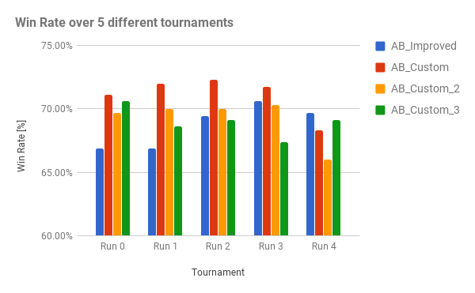

*Udacity Artificial Intelligence nanodegree*  
*Project: Build a Game-Playing Agent*

#Heuristic Analysis
by C. Chevalier, June 2017  
  
### Custom Score functions 

```
def custom_score(game, player):
    return float(own_moves - 4 * opp_moves)


def custom_score_2(game, player):
    return float(own_moves - 2 * opp_moves)


def custom_score_3(game, player):
    return float(own_moves - 0.5 * opp_moves)
```


### Overall results
                                               
```
 Match #   Opponent    AB_Improved   AB_Custom   AB_Custom_2  AB_Custom_3
--------------------------------------------------------------------------
 Run 0     Win Rate:      66.9%        71.1%        69.7%        70.6%
 Run 1     Win Rate:      66.9%        72.0%        70.0%        68.6%
 Run 2     Win Rate:      69.4%        72.3%        70.0%        69.1%
 Run 3     Win Rate:      70.6%        71.7%        70.3%        67.4%
 Run 4     Win Rate:      69.7%        68.3%        66.0%        69.1%
--------------------------------------------------------------------------
 Mean	                  68.7%	       71.1%        69.2%        69.0%
 																
```

  
--- 
   
   
   
   
## Appendix: Detailed Results

###Run 0
```
This script evaluates the performance of the custom_score evaluation
function against a baseline agent using alpha-beta search and iterative
deepening (ID) called `AB_Improved`. The three `AB_Custom` agents use
ID and alpha-beta search with the custom_score functions defined in
game_agent.py.

                        *************************
                             Playing Matches
                        *************************
                        
 Match #   Opponent    AB_Improved   AB_Custom   AB_Custom_2  AB_Custom_3
                        Won | Lost   Won | Lost   Won | Lost   Won | Lost
    1       Random      47  |   3    49  |   1    47  |   3    48  |   2
    2       MM_Open     38  |  12    35  |  15    37  |  13    40  |  10
    3      MM_Center    42  |   8    44  |   6    45  |   5    47  |   3
    4     MM_Improved   32  |  18    34  |  16    37  |  13    34  |  16
    5       AB_Open     25  |  25    29  |  21    22  |  28    24  |  26
    6      AB_Center    28  |  22    33  |  17    32  |  18    29  |  21
    7     AB_Improved   22  |  28    25  |  25    24  |  26    25  |  25
--------------------------------------------------------------------------
           Win Rate:      66.9%        71.1%        69.7%        70.6%
```

###Run 1

```
 Match #   Opponent    AB_Improved   AB_Custom   AB_Custom_2  AB_Custom_3
                        Won | Lost   Won | Lost   Won | Lost   Won | Lost
    1       Random      45  |   5    47  |   3    47  |   3    45  |   5
    2       MM_Open     37  |  13    39  |  11    33  |  17    38  |  12
    3      MM_Center    43  |   7    44  |   6    45  |   5    36  |  14
    4     MM_Improved   31  |  19    38  |  12    34  |  16    39  |  11
    5       AB_Open     21  |  29    26  |  24    29  |  21    26  |  24
    6      AB_Center    29  |  21    30  |  20    27  |  23    29  |  21
    7     AB_Improved   28  |  22    28  |  22    30  |  20    27  |  23
--------------------------------------------------------------------------
           Win Rate:      66.9%        72.0%        70.0%        68.6%
```
                                                            
###Run 2                                                     
                                                            
```
 Match #   Opponent    AB_Improved   AB_Custom   AB_Custom_2  AB_Custom_3
                        Won | Lost   Won | Lost   Won | Lost   Won | Lost
    1       Random      47  |   3    47  |   3    47  |   3    46  |   4
    2       MM_Open     36  |  14    41  |   9    39  |  11    37  |  13
    3      MM_Center    43  |   7    47  |   3    46  |   4    45  |   5
    4     MM_Improved   38  |  12    38  |  12    39  |  11    35  |  15
    5       AB_Open     28  |  22    30  |  20    26  |  24    29  |  21
    6      AB_Center    29  |  21    29  |  21    26  |  24    27  |  23
    7     AB_Improved   22  |  28    21  |  29    22  |  28    23  |  27
--------------------------------------------------------------------------
           Win Rate:      69.4%        72.3%        70.0%        69.1%
```
                                                            
###Run 3                                                     
                                                            
```
 Match #   Opponent    AB_Improved   AB_Custom   AB_Custom_2  AB_Custom_3
                        Won | Lost   Won | Lost   Won | Lost   Won | Lost
    1       Random      46  |   4    48  |   2    43  |   7    49  |   1
    2       MM_Open     39  |  11    40  |  10    34  |  16    38  |  12
    3      MM_Center    43  |   7    44  |   6    48  |   2    40  |  10
    4     MM_Improved   36  |  14    36  |  14    38  |  12    35  |  15
    5       AB_Open     26  |  24    28  |  22    26  |  24    24  |  26
    6      AB_Center    30  |  20    29  |  21    31  |  19    27  |  23
    7     AB_Improved   27  |  23    26  |  24    26  |  24    23  |  27
--------------------------------------------------------------------------
           Win Rate:      70.6%        71.7%        70.3%        67.4%
```
                                                            
###Run 4                                                     
                                                            
```
 Match #   Opponent    AB_Improved   AB_Custom   AB_Custom_2  AB_Custom_3
                        Won | Lost   Won | Lost   Won | Lost   Won | Lost
    1       Random      42  |   8    46  |   4    43  |   7    46  |   4
    2       MM_Open     39  |  11    36  |  14    34  |  16    36  |  14
    3      MM_Center    43  |   7    40  |  10    42  |   8    44  |   6
    4     MM_Improved   36  |  14    33  |  17    31  |  19    36  |  14
    5       AB_Open     27  |  23    27  |  23    25  |  25    26  |  24
    6      AB_Center    28  |  22    30  |  20    30  |  20    29  |  21
    7     AB_Improved   29  |  21    27  |  23    26  |  24    25  |  25
--------------------------------------------------------------------------
           Win Rate:      69.7%        68.3%        66.0%        69.1%
```
